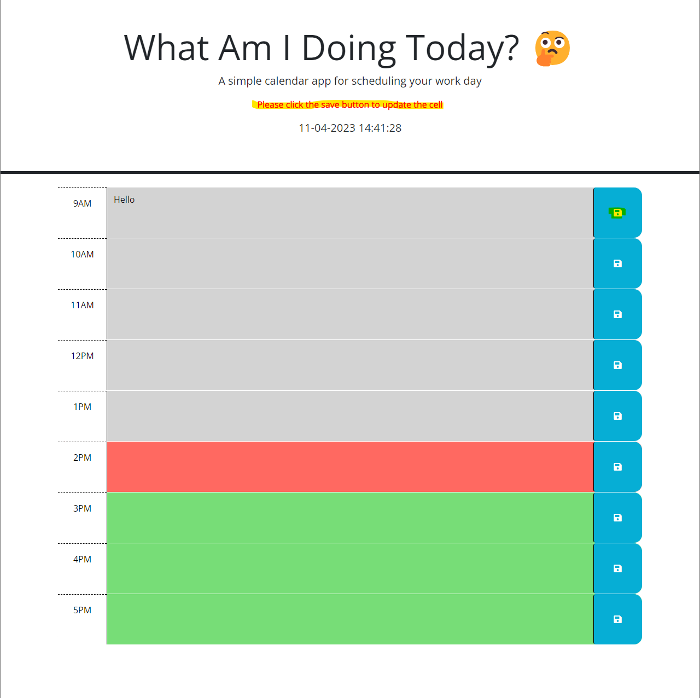

# What Am I Doing Today?

## Description

This project was created for two main purposes: Firstly, to create a work day schedule that can dynamically update. Lastly, to test my culmative knowledge of HTML, CSS, jQuery, and JavaScript. My project helps solve the budy day-to-day hassle of keeping track of important tasks. Whether coding or working, constant information overload makes it hard to keep track of what we need to do. Throughout this project, I refined my jQuery knowledge and how it differs from vanilla JavaScript. 

## Installation

There are no installtion requirements. Users can run on their native browser and start keeping track of important tasks.

## Usage

Usage for this web application is simple! Navigate to the webpage. User will see the date and time located at the top of the webpage title. Based on the current time, the time blocks will either be grey (time is in the past), red (time is current), or green (time is in the future). Start by entering text in your desired time block and then click the blue save button. If you wish to delete something, delete the desired text from the time block and then click the blue save button. If you refresh the page, the user text will be persistent and refresh into the appropriate time block. 

    ```md
    
    ```

## Credits

N/A

## License

This project is under a MIT License. 